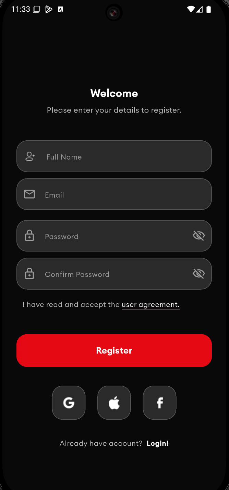
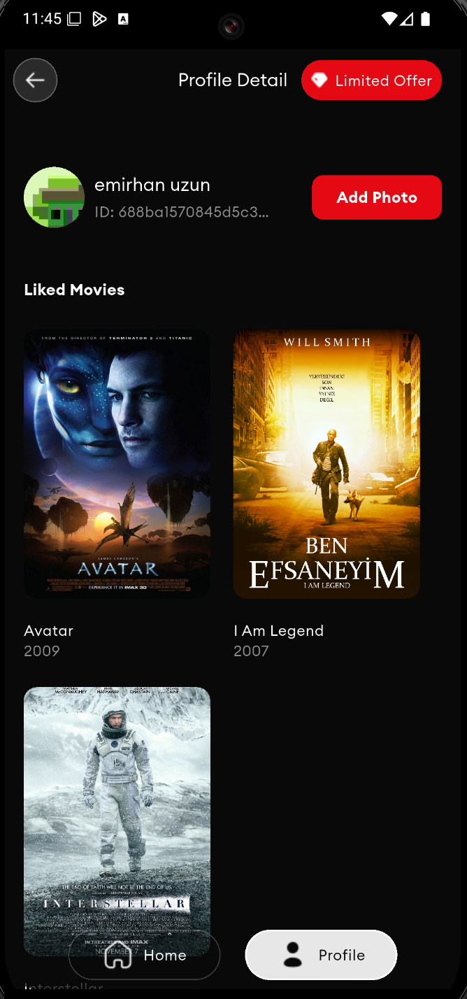
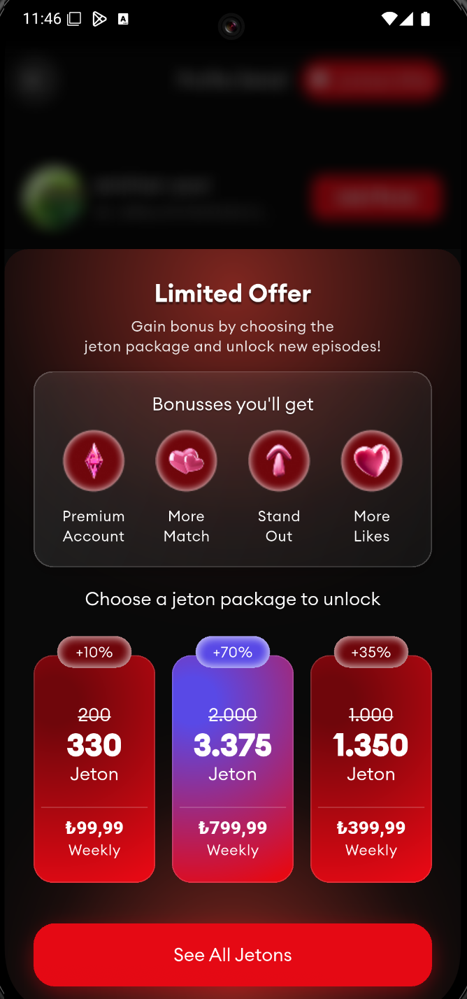
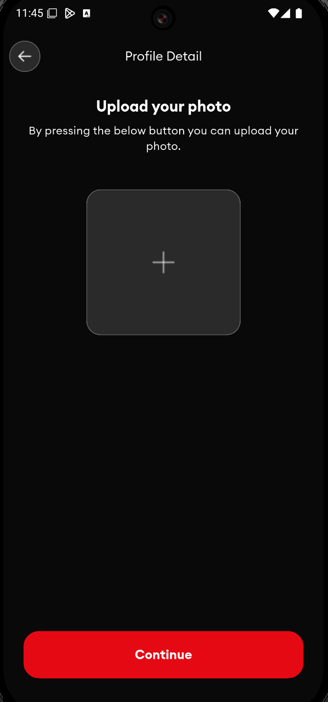

# Dating App - Flutter Teknik Değerlendirme Projesi

Bu proje, Dating app mantığında tasarlanmış bir Film Uygulamasıdır ve Flutter ile geliştirilmiştir. Proje, modern mobil uygulama geliştirme prensipleri, temiz kod mimarisi ve en iyi pratikler göz önünde bulundurularak hazırlanmıştır.

## 🚀 Kullanılan Teknolojiler ve Paketler

Proje, Flutter framework'ünün gücünden ve zengin ekosisteminden faydalanmaktadır. Aşağıda projede kullanılan ana teknolojiler ve paketler listelenmiştir:

### Temel Çatı
- **[Flutter](https://flutter.dev/)**: Google tarafından geliştirilen, tek bir kod tabanından mobil, web ve masaüstü için güzel, yerel olarak derlenmiş uygulamalar oluşturmaya yönelik kullanıcı arayüzü araç takımı.
- **[Dart](https://dart.dev/)**: Flutter uygulamalarını güçlendiren, istemci için optimize edilmiş bir programlama dili.

### Durum Yönetimi (State Management)
- **[flutter_bloc](https://pub.dev/packages/flutter_bloc)**: Widget'ları sunum katmanından ayırmayı kolaylaştıran, öngörülebilir ve test edilebilir bir durum yönetimi kütüphanesi.
- **[bloc_concurrency](https://pub.dev/packages/bloc_concurrency)**: BLoC olayları için `debounce`, `throttle` gibi gelişmiş kontrol mekanizmaları sunar.

### Bağımlılık Yönetimi (Dependency Injection)
- **[get_it](https://pub.dev/packages/get_it)**: Servislere ve sınıflara kolay erişim sağlayan bir servis bulucu (Service Locator).
- **[injectable](https://pub.dev/packages/injectable)**: `get_it` için kod üretimi yaparak manuel bağımlılık tanımlamalarını ortadan kaldırır.

### Ağ (Networking)
- **[dio](https://pub.dev/packages/dio)**: HTTP istekleri için güçlü bir istemci. Interceptor, form verisi, dosya indirme gibi gelişmiş özellikler sunar.
- **[retrofit](https://pub.dev/packages/retrofit)**: Dio için REST API'lerini kolayca tanımlamayı sağlayan bir kod üreteci.

### Yerel Depolama (Local Storage)
- **[flutter_secure_storage](https://pub.dev/packages/flutter_secure_storage)**: Kimlik doğrulama token'ları gibi hassas verileri güvenli bir şekilde (Keychain/Keystore) saklamak için kullanılır.
- **[shared_preferences](https://pub.dev/packages/shared_preferences)**: Basit anahtar-değer verilerini (ayarlar vb.) saklamak için kullanılır.

### Kullanıcı Arayüzü (UI)
- **[cached_network_image](https://pub.dev/packages/cached_network_image)**: Ağdan gelen resimleri önbelleğe alarak performansı artırır.
- **[image_picker](https://pub.dev/packages/image_picker)**: Cihaz galerisinden veya kameradan resim seçmeyi sağlar.
- **[lottie](https://pub.dev/packages/lottie)**: Yüksek kaliteli animasyonları (Lottie/JSON) kolayca uygulamaya ekler.
- **[flutter_screenutil](https://pub.dev/packages/flutter_screenutil)**: Farklı ekran boyutlarına uyumlu, duyarlı (responsive) UI tasarımları oluşturmayı kolaylaştırır.
- **[inner_shadow_container](https://pub.dev/packages/inner_shadow_container)**: Widget'lara iç gölge efekti eklemek için kullanılır.

### Navigasyon (Navigation)
- **[go_router](https://pub.dev/packages/go_router)**: URL tabanlı, bildirimsel (declarative) bir yönlendirme çözümü sunar.

### Firebase Entegrasyonu
- **[firebase_core](https://pub.dev/packages/firebase_core)**: Firebase servislerini Flutter projesine entegre etmek için gereklidir.
- **[firebase_crashlytics](https://pub.dev/packages/firebase_crashlytics)**: Uygulama çökmelerini anlık olarak takip edip raporlar.
- **[firebase_analytics](https://pub.dev/packages/firebase_analytics)**: Kullanıcı etkileşimlerini ve uygulama kullanım verilerini analiz eder.

### Yardımcı Paketler (Utils)
- **[logger](https://pub.dev/packages/logger)**: Geliştirme sürecinde daha okunaklı ve düzenli loglar oluşturur.
- **[equatable](https://pub.dev/packages/equatable)**: Dart nesneleri arasında değer bazlı karşılaştırma yapmayı basitleştirir.
- **[json_annotation](https://pub.dev/packages/json_annotation)** / **[json_serializable](https://pub.dev/packages/json_serializable)**: JSON serileştirme ve deserileştirme için kod üretimi sağlar.
- **[dartz](https://pub.dev/packages/dartz)**: Fonksiyonel programlama özellikleri (örn. `Either`, `Option`) sunarak hata yönetimini kolaylaştırır.
- **[easy_localization](https://pub.dev/packages/easy_localization)**: Uygulamaya çoklu dil desteği eklemeyi basitleştirir.

### Geliştirme Bağımlılıkları (Dev Dependencies)
- **[build_runner](https://pub.dev/packages/build_runner)**: Kod üreten paketler (`injectable`, `retrofit`, `json_serializable`) için kullanılır.
- **[flutter_launcher_icons](https://pub.dev/packages/flutter_launcher_icons)**: Uygulama ikonunu otomatik olarak Android ve iOS için oluşturur.
- **[flutter_lints](https://pub.dev/packages/flutter_lints)**: Kod kalitesini artırmak için statik analiz kuralları sunar.

## ✨ Özellikler

- **Kimlik Doğrulama:**
  - Kullanıcı adı ve şifre ile **Giriş Yapma** ve **Kayıt Olma**.
  - API'den alınan `access_token`'ın **flutter_secure_storage** ile güvenli bir şekilde saklanması.
- **Ana Sayfa:**
  - Filmlerin **sonsuz kaydırma (infinite scroll)** ile listelenmesi (her istekte 5 film).
  - **Pull-to-refresh** (aşağı çekerek yenileme) özelliği.
  - Veri yüklenirken gösterilen **loading indikatörü**.
  - Favoriye ekleme/çıkarma işlemlerinde anlık arayüz güncellemesi.
- **Profil Ekranı:**
  - Kullanıcı bilgilerinin (ad, soyad vb.) gösterilmesi.
  - Kullanıcının favori filmlerinin listelenmesi.
  - Profil fotoğrafını galeriden seçip güncelleme.
- **Navigasyon:**
  - **Bottom Navigation Bar** ile Ana Sayfa, Favoriler ve Profil ekranları arasında kolay geçiş.
  - `go_router` ile yönetilen, state'i koruyan (örn. Ana Sayfa listeleme pozisyonu) navigasyon yapısı.
- **Splash Screen:** Uygulama açılışında gösterilen başlangıç ekranı.
- **Animasyonlar:** `Lottie` ile zenginleştirilmiş yükleme animasyonları.

## 🔧 Kurulum Talimatları

Projeyi yerel makinenizde çalıştırmak için aşağıdaki adımları izleyin:

1. **Flutter SDK'nın kurulu olduğundan emin olun.**
   - [Flutter Kurulum Talimatları](https://flutter.dev/docs/get-started/install)

2. **Projeyi klonlayın:**
   ```bash
   git clone https://github.com/kullanici-adiniz/dating-app.git
   cd dating-app
   ```

3. **Gerekli paketleri yükleyin:**
   ```bash
   flutter pub get
   ```

4. **Kod üretimini çalıştırın:**
   (Retrofit, Injectable, vb. için gereklidir)
   ```bash
   dart run build_runner build --delete-conflicting-outputs
   ```

5. **Uygulamayı çalıştırın:**
   ```bash
   flutter run
   ```

## 📱 Uygulama Görselleri

*(Bu bölüme, projenin ekran görüntülerini `screenshots/` klasörü oluşturup ekleyebilirsiniz.)*

| Video Kaydı | 
| :----------: |
|  |

| Splash Ekranı | Login Ekranı | Register Ekranı |
| :----------: | :-------: | :------------: |
|  |  |  |

| Ana Sayfa Ekranı | Profil Ekranı | Teklif Ekranı |
| :----------: | :-------: | :------------: |
|  |  |  |

| Fotoğraf Güncelleme Ekranı |
| :----------: |
|  |


## 🏗️ Proje Mimarisi

Proje, sürdürülebilir, ölçeklenebilir ve test edilebilir bir kod tabanı oluşturmak amacıyla **Clean Architecture** prensiplerine uygun olarak tasarlanmıştır. Bu mimari, katmanlar arasında net bir sorumluluk ayrımı sağlar.

- **Data Katmanı:** API (Retrofit) ve yerel depolama (SharedPreferences, Secure Storage) gibi veri kaynaklarını yönetir. Repository deseninin implementasyonunu içerir.
- **Domain Katmanı:** Uygulamanın iş mantığını ve kurallarını içerir. Use case'ler (kullanım senaryoları) ve model sınıfları (entities) bu katmanda yer alır. Hiçbir dış kütüphaneye bağımlılığı yoktur.
- **Presentation (UI) Katmanı:** Kullanıcı arayüzünü (widget'lar) ve durum yönetimini (BLoC) içerir. Kullanıcı etkileşimlerini alır ve sonucu ekranda gösterir.

Bu yapı, **MVVM (Model-View-ViewModel)** tasarım deseninden ilham alır:
- **Model:** Domain katmanındaki entity'ler.
- **View:** Flutter widget'ları.
- **ViewModel:** BLoC sınıfları, UI'ın ihtiyaç duyduğu veriyi ve durumu yönetir.

**BLoC State Management**, UI ve iş mantığını ayırmak için kullanılmıştır. Her özellik (feature) kendi BLoC'una sahiptir ve olayları (events) alıp durumları (states) yayınlar. Bu sayede reaktif ve öngörülebilir bir UI akışı sağlanır.

## 🏆 Bonus Özellikler

- **Custom Theme:** Açık ve koyu tema desteği.
- **Navigation Service:** `go_router` ile merkezi ve bildirimsel bir yönlendirme hizmeti.
- **Logger Service:** Geliştirme sürecini kolaylaştıran konsol loglama servisi.
- **Uygulama İkonu:** Projeye özel tasarlanmış uygulama ikonu.
- **Animasyonlar:** `Lottie` kullanılarak eklenen akıcı yükleme animasyonları.

## 🌐 Dil Desteği (Localization)

Uygulama, `easy_localization` paketi ile **Türkçe (TR)** ve **İngilizce (EN)** dillerini desteklemektedir. Dil dosyaları `assets/translations` klasöründe bulunmaktadır.

## 📊 Crashlytics & Analytics

- **Firebase Crashlytics:** Uygulamada meydana gelen çökmeler anlık olarak takip edilir ve geliştiriciye raporlanır. Bu, hataları hızlı bir şekilde tespit edip çözmeyi sağlar.
- **Firebase Analytics:** Kullanıcıların uygulama içindeki davranışları (ekran görüntülemeleri, buton tıklamaları vb.) anonim olarak izlenir. Bu veriler, kullanıcı deneyimini iyileştirmek için kullanılır.

## 🔗 API ve Kaynaklar

Bu projede kullanılan API'ler ve diğer kaynaklar hakkında bilgiler:
- **API:** Proje için kullanılan API endpoint'leri (varsa dokümantasyon linki eklenebilir).
- **İkonlar ve Varlıklar:** Projede kullanılan ikonlar ve diğer varlıklar `assets/` klasöründe bulunmaktadır.

## 👨‍💻 Geliştirici Notları ve Katkıda Bulunma

Bu proje bir teknik değerlendirme amacıyla geliştirilmiştir. Katkıda bulunmak isterseniz, lütfen bir "issue" açın veya "pull request" gönderin. Kod standartları için `flutter_lints` kurallarına uyulması beklenmektedir.

## 📄 Lisans

Bu proje **MIT Lisansı** ile lisanslanmıştır. Detaylar için `LICENSE` dosyasına bakınız.